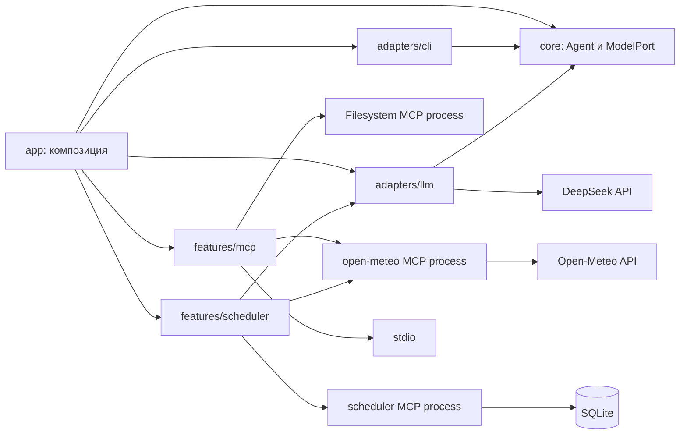

# Архитектура

## Текущее приложение

Исполняемый workspace `apps/host` и два самостоятельных MCP-сервера в `servers/*`: `open-meteo` и
`scheduler`. Общих библиотек нет. Skills и материалы экспериментов — каталоги документов.

`app/main.ts` принимает окружение, argv, путь Node и потоки; `app/compose.ts` собирает приложение.
Модель создаётся лениво при первом ask, поэтому справка, настройки и discovery MCP доступны без ключа.

Agent инкапсулирует ModelPort и текст системной инструкции. `respond(input, toolSource?)` проверяет
непустой ввод, передаёт system + user и, если передан `toolSource`, список его инструментов первым
запросом модели. Текстовый ответ модели возвращается сразу; `tool_calls`-ответ допускает ровно один
вызов (`MAX_TOOL_CALLS_PER_TURN = 1`), после которого выполняется один добавочный запрос модели с
результатом инструмента — второй `tool_calls`-ответ завершает turn ошибкой лимита. Диалог, usage и
состояние между вызовами `respond()` не накапливаются. В ядре нет SDK, файлов, env, CLI-команд и
пользовательских подсказок; `ToolSource`, `ToolDefinition`, `ToolCall` и `ToolResult` — provider- и
MCP-нейтральные типы core.

DeepSeekModel отвечает за формат SDK, лимит ответа, таймаут и перевод ошибок в AgentError.
`tools`/`tool_calls` core-контракта переводятся в OpenAI-совместимые `tools`/`tool_choice`/`tool_calls`;
пустой список инструментов не добавляет `tools` в wire-запрос, сохраняя прежний простой вид.
SDK-повторы отключены, reasoning отключён явно. При finish_reason, отличном от stop и tool_calls,
возвращается ошибка. Тело ошибки провайдера не попадает в ошибку ядра или stderr; сохраняется только
HTTP-статус при наличии. Текущая модель по умолчанию — deepseek-flash, имя меняется настройкой.

CLI получает реестр обработчиков и потоки, не создаёт агента и не знает SDK.
Вывод оформляет один CliView из compose.ts: обработчики передают ему типизированные данные реестров,
ответа и discovery, а цвет решает `styleText` отдельно для stdout и stderr. Перед финальным ответом
`ask`, если модель вызвала инструмент, CliView печатает одну строку `MCP: <имя инструмента> —
выполнено`/`— ошибка`; без tool call строки нет.
Текст из REPL становится вызовом ask; `/команда` и подкоманда CLI используют один dispatch.
В REPL текст после /ask сохраняется буквально; quoting нужен только оболочке при однократном запуске.

Фича MCP содержит два независимых жизненных цикла. `discoverFilesystemTools` запускает установленный
Filesystem-сервер отдельным процессом и владеет одним stdio-соединением на вызов `mcp tools`: после
legacy-инициализации (`2025-11-25`) проверяет capability tools, получает список и закрывает клиент с
транспортом; CLI форматирует серверные имя, версию и описания, Agent и ModelPort не участвуют.
`withStdioToolSource` — вторая, современная операция: на каждый `ask` запускает собственный
`servers/open-meteo` MCP-процесс, договаривается о ревизии `2026-07-28` (`versionNegotiation.mode =
"auto"`) и передаёт callback-объект `ToolSource`, использующий тот же Client, в `Agent.respond()`;
закрывает Client в `finally` независимо от исхода `use`. Обе операции используют настройку
`mcp.timeoutMs` и собственные типизированные ошибки (`McpDiscoveryError` и `McpToolSourceError`).

`ask` получает инструменты двух серверов сразу: `app/ask.ts` запускает сессию `open-meteo` и публичный режим
`servers/scheduler` и объединяет их `ToolSource` в `app/toolSources.ts` — вызов направляется по имени инструмента,
повторяющееся имя отклоняется, лимит одного tool call за реплику по-прежнему держит Agent. Обе сессии
закрываются вместе, независимо от исхода.

Фича `scheduler` (ADR 0004) — фоновая работа без реплики пользователя. `scheduler run` занимает терминал и
запускает цикл worker в процессе host: `app/scheduler.ts` открывает два постоянных stdio-соединения (`open-meteo`
и `servers/scheduler --worker`), передаёт их фиче как узкие порты и `ModelPort` без изменения `core`. Цикл
последовательно опрашивает погоду по срокам, которые назначает сервер, а на сроке сводки считает показатели за
24 часа, один раз вызывает модель (`tools: []`, `toolChoice: "none"`), проверяет период и число наблюдений в её
ответе и отдаёт готовый Markdown серверу; после подтверждения сохранения сводка печатается в том же терминале.
Состоянием (расписания, каждый опрос, тексты сводок) владеет сервер: SQLite и `.md`-копия — только за ним, а
единственность worker обеспечивает блокировка на файле рядом с базой, которую ОС снимает при любом завершении.
`scheduler summary` читает сохранённый текст через публичный режим сервера без модели. Сигнал остановки создаёт
`main.ts`; worker доводит начатую операцию до сохранения и закрывает соединения. Структурированный результат погоды
worker читает своим типизированным адаптером, потому что `ToolSource` из `core` передаёт только текст.

## Границы и рост

Разрешённые импорты: app → core/adapters/features; adapters → core и публичные порты features;
features → core. Внутри фичи можно разделять предметную часть и её специфические адаптеры.
Предметная часть не должна импортировать собственный инфраструктурный адаптер; это проверяется review.
Общие адаптеры находятся в adapters, предметные — при своей фиче.

Внешний вход фичи — index.ts. Фичи не импортируют друг друга даже через публичные входы.
Каждая фича содержит README, собственные тесты и, при необходимости, prompts/*.md.
Тесты внутри фичи могут обращаться к её внутренним файлам; интеграционные тесты используют публичные входы.
Серверы не импортируют host или друг друга; host не импортирует исходники серверов.
При появлении нового процесса у него собственный composition root.

Сейчас в core есть ModelPort и ToolSource (принят ADR 0003). ContextStep, TraceSink и контракты
хранилищ заранее не объявляются: состояние планировщика принадлежит его MCP-серверу, а не `core`. Когда задание потребует новый контракт, сначала принимается ADR с конкретным
потребителем и проверяемой границей. После этого фичи используют контракт без добавления условий по
своим именам в ядро. Composition root может выбирать реализации по настройкам; это не задача ядра.

Не использовать общий mutable context или расширяемый объект с полями всех фич.
При появлении состояния модуль владеет им сам; наружу отдаёт снимки и узкие операции.
Правило записи: кандидат → save → замена. Временный файл и rename относятся к одному файлу.
Markdown-журнал не заменяет машинный снимок, если понадобятся точные идентификаторы протокольных сообщений.

## Настройки и документы

`app/settings.ts` — единственный реестр схем, defaults и признаков настроек.
Env и флаги вычисляются из ключей. `app/settings.md` содержит исходные описания.
Порядок — default, YAML-файл, env, CLI; некорректный заданный источник отклоняется, даже если перекрыт следующим.
YAML использует плоские ключи с точками; вложенных деревьев и слияния массивов сейчас нет.
Путь config.file выбирается до чтения YAML и не может задаваться самим YAML-файлом.
Отсутствующий стандартный файл допустим; отсутствие явно указанного файла — ошибка.
Секреты не имеют CLI-флага и файлового значения. `.env` автоматически не загружается.

Команды описаны в `app/commands.ts`, тексты — в `app/commands.md`.
Справка, таблица команд и таблица настроек генерируются, `docs:check` обнаруживает рассинхронизацию.
Системная инструкция хранится в system.md; Markdown-ресурсы читаются относительно import.meta.url.
Все `.md` из src копируются в dist с сохранением путей.

Содержательные инструкции, память, заметки, журналы и отчёты — Markdown.
Структура остаётся в схемах, API/MCP-сообщениях, конфигурации и необходимом машинном состоянии.
Короткие UI-сообщения допустимы в адаптере CLI; промпты и содержательная справка в строках TS запрещены.

## Архитектурные проверки

`tooling/dependencies.ts` запускает dependency-cruiser с правилами из dependency-rules.ts.
Проверяются циклы, разрешение импортов, независимость ядра, публичные входы фич,
межфичевые связи, границы серверов, production → tests/tooling. `import type` входит в граф.
Правила публичных входов строятся по фактическим каталогам фич.
Тесты проверки создают отдельные временные проекты и проверяют относительные и workspace-импорты.

`tooling/size.ts` считает строки с токенами кода через TypeScript scanner и функции через AST.
Пределы: файл 300, тест 400, функция 60; контейнер describe из Vitest исключён, тело it — нет.
Сгенерированные dist/coverage, зависимости и Git исключены. Реестры исключений не имеют.
`structure.ts` также проверяет шаблоны модулей, пару AGENTS/CLAUDE и место доступа к process.
Корневой и вложенные AGENTS ограничены 120 физическими строками.

TypeScript закреплён на 5.9.3: guardrails используют стабильный Compiler API.
В TypeScript 7 Compiler API изменён; переход выполняется отдельно с проверкой tooling.
Node исполняет TS напрямую, typecheck остаётся отдельным обязательным шагом.
Dependency-cruiser, Biome, Vitest и TypeScript закреплены в package.json и package-lock.json.

Общий npm run check используется в pre-commit и CI. Локальный hook устанавливается явно;
его можно обойти средствами Git, поэтому CI остаётся обязательной частью процесса.
Удалённые branch protection и публикация в GitHub не настраивались.

## Что ещё не реализовано

Есть MCP discovery Filesystem-сервера по stdio, native tool calling собственных серверов (`get_current_weather`,
`schedule_weather`, `get_weather_summary`, `cancel_weather_schedule`; максимум один tool call за реплику) и
планировщик погоды с worker в host и SQLite-состоянием в сервере планировщика. Постоянные сессии `ask`,
несколько tool rounds, параллельные вызовы, общий агрегатор MCP-серверов с политиками и подтверждениями,
Streamable HTTP, история диалога, память, профили, трассировка, skills и runner экспериментов не
реализованы. Планировщик работает, пока запущен процесс `scheduler run`: автозапуска (`launchd`, службы),
переподключения к упавшему серверу и параллельных операций worker нет.
Выбор API следующих серверов и ревизий MCP выполняется при получении соответствующего задания.
Документация [направлений курса](docs/course.md) не является списком обязательных текущих работ.
